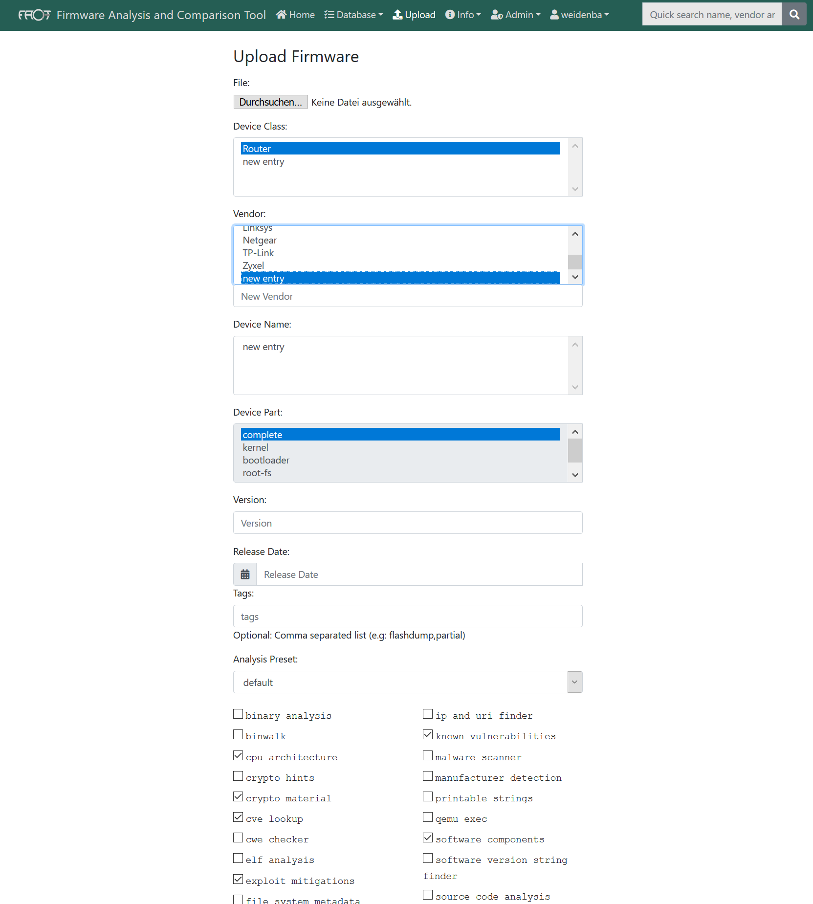
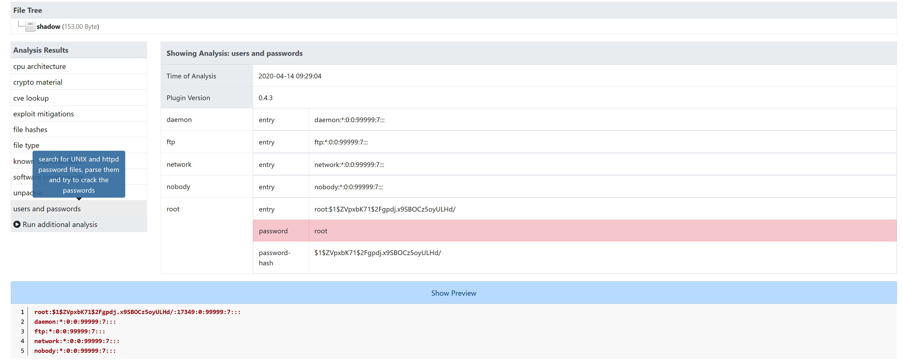
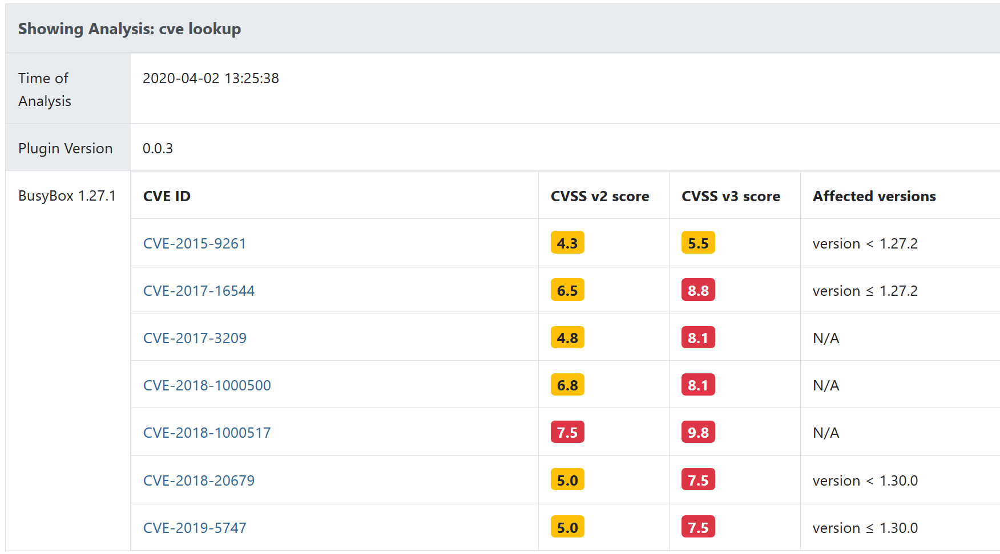
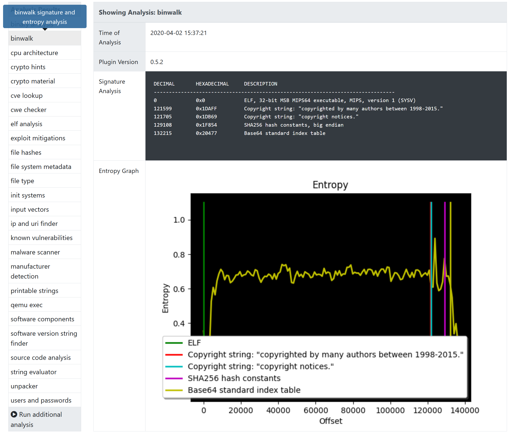
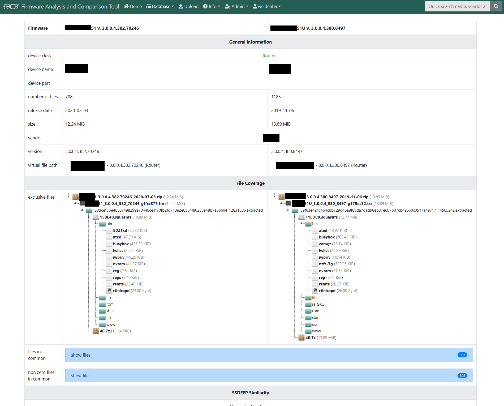
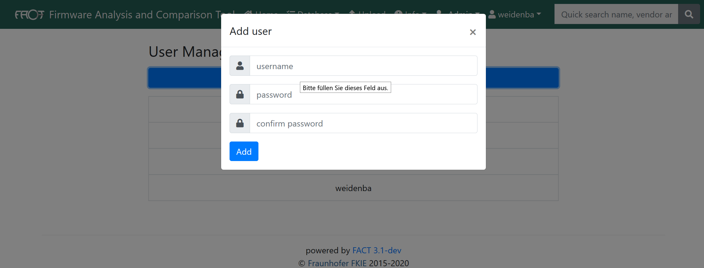

Challenges
==========

Firmware analysis is a tough challenge with a lot of tasks.
Many of these tasks can be automated (either with new approaches or incorporation of existing tools) so that a security analyst can focus on his main task: Analyzing the firmware (and finding vulnerabilities).
FACT implements this automation leading to more complete analysis as well as a massive speedup in vulnerability hunting (see picture blow).

.. image:: images/FACT_Vulnerability_Hunting.png
   :width: 100%
   :alt: FACT analysis speedup

Challenge: Firmware Extraction
-----------------------------------------------

Extraction of a firmware image can be very time consuming.
At first you have to identify the container format.
Afterwards you need to find an appropriate unpacker.
If no extraction tool is available you might try a file carver like binwalk to extract at least some of the firmware components.
When you finished this task you must re-do these tasks for each layer multiple times.
FACT automates the whole process.

Challenge: Initial Firmware Analysis
-----------------------------------------------

The next challenge is to find out as much about the firmware as possible to identify potential risks and vulnerabilities. A few of these challenges solved by FACT are listed below:

* Software identification

   * Which OS is used?
   * Which programs are present?
   * Which versions are used?
   * Which services are started on boot?
   * Are there any well-known vulnerabilities in these? (CVEs)

* Find login credentials, especially hard-coded passwords
* Crypto material detection

   * private keys
   * certificates

* Detect CPU architecture (needed for emulation and disassembling)
* Check if executable utilizing QEMU (needed for fuzzing and debugging)
* Look for implementation flaws (CWEs)
* ...

Challenge: Firmware Comparison
-----------------------------------------------

In many cases you might want to compare Firmware samples.
For instance, you might want to know if and where a manufacturer fixed an issue in a new firmware version.
Or you might want to know if the firmware on your device is the original firmware of provided by the manufacturer.
If they differ, you want to know which parts are changed for further investigation.
Again FACT is able to automate many of these challenges:

* Identify changed / equal files
* Identify changed software versions
* …

Challenge: Find other affected Firmware Images
-----------------------------------------------

If you find a new vulnerability or a new container format, you might want to know if other firmware images share your finding.
Therefore, FACT stores all firmware files and analysis results in a searchable database.
You can search for byte patterns on all unpacked files as well as any kind of analysis result.

Easy to Install! Easy to Use!
==================================

FACT provides an installation script for Ubuntu 18.04 that installs FACT as well as all dependencies automatically.
The installation script supports Ubuntu 19.04, Debian 9, Debian 10, Kali 2019.4, as well.
However, there might be minor issues on these, because we do not actively develop on these platforms. If you find a bug please tell us.
Have a look at the  `README <https://github.com/fkie-cad/FACT_core/blob/master/README.md>`_ for more details.
Furthermore, there is a web GUI so that you can start right away without any further knowledge about FACT or the firmware you want to look at.

Easy to Extend! Easy to Integrate!
======================================

FACT is based on a plug-in concept.
Extractors, analysis features and compare functionalities are implemented as plug-ins.
More details can be found in the `Developer’s Manual <https://github.com/fkie-cad/FACT_core/wiki>`_.
Integration is easy as well since we provide a REST API covering almost all of FACT’s features.
More Details can be found in our `REST API documentation <https://github.com/fkie-cad/FACT_core/wiki/Rest-API>`_.

Screenshots
==================================

.. image:: images/01_main.png
   :width: 30%

.. image:: images/03_firmware_view.png
   :width: 30%

.. image:: images/07_qemu_exec.png
   :width: 30%

.. image:: images/09_system.png
   :width: 30%

.. image:: images/11_advanced_search_result.png
   :width: 30%
.. image:: images/12_yara_search.png
   :width: 30%

Contributing
==================================

There are many ways to contribute to FACT.
For instance, you can write an unpacking, compare or analysis plug-in.
You can develop your plug-in in your own repository under your favorite license.
It can be added to a local FACT installation as git submodule.
Have a look at `FACT’s Developer’s Manual <https://github.com/fkie-cad/FACT_core/wiki>`_ for more details.
If you developed a plug-in, we would love to hear about it.
We are going to provide a list of all available plug-ins.
You are welcome to improve the FACT_core as well.
Please have a look at our `Coding Guidelines <https://github.com/fkie-cad/FACT_core/wiki/coding-guidelines>`_ before creating a pull request.
No matter how you would like to contribute: If you have any question, do not hesitate to ask.

Latest News and Contact
==================================

Follow us on Twitter `@FAndCTool <https://twitter.com/FAandCTool>`_ to get the latest news about FACT.
If you have any further questions, write a `mail <mailto:firmware-security@fkie.fraunhofer.de>`_.

Authors and Acknowledgment
==================================

FACT is developed by `Fraunhofer FKIE <https://www.fkie.fraunhofer.de>`_ and the FACT community.
Development is partly financed by `German Federal Office for Information Security (BSI) <https://www.bsi.bund.de>`_ and others.

Source Code
==================================

Source code and issue board live at `GitHub <https://github.com/fkie-cad/FACT_core/wiki>`_.